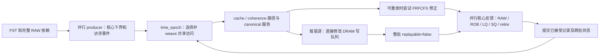

# LBM：当前两阶段关键路径与机制修复设计

日期：2026-09-11。状态：原固定计分分母的 P0 诊断能力已接入，见
[P0 实施与验证记录](context-execution-p0-20260911.md)。随后按用户要求修订 P0 为
“共同终点前持续采集且持续计分”，随后指定最快核到 10M 即共同停止。
首核停止采集补丁与边界校验已通过短采集，40 个 case 重采集见
`tmp/first-core-common-end-20260911/`；P1–P3 尚未实施。

本次选定边界规则以 [项目规约 §3.0](project-goal-and-semantic-contract.md) 为准。
下文旧 C4/C32 数值是保留原人口的历史诊断，不能作为新共同窗口的精度结果。

依据为当前生产源码、冻结的 formal40 配置及
[LBM 完整 ROI / 已采区间审计](lbm-full-roi-error-audit-20260911.md)。
以下源码位置与“当前行为”描述保留原设计审查时的状态。该设计阶段没有修改生产代码、
运行模拟或重新启动 gem5；当时三个核心源码与审计指纹一致。后续 P0 改动及实测结果
以实施记录为准。

## 1. 结论与证据强度

需要修复两条相互独立、最终共同影响内存竞争的链路：

1. **最快核达到 10M 时，所有核心共同结束采集与计分。** 慢核可以不足 10M，
   每核共同窗口内的实际工作全部进入 CPI 和 PMU；不得继续采用各核独立截断、
   等最慢核或固定分母配不计分后缀作为默认正式测量方式。
2. **第二阶段把混合读写服务与实际请求起点闭合。** 写回成为显式事件，读写队列及
   服务身份跨 Q 保留；实际 store 准入对应的响应驱动 SQ 释放。到达变化使原服务
   失效时，恢复相关资源与核心局部状态，而不是平移旧 latency。

保留 `interval_weave + time_epoch`、Q=1024、并行 producer、共享批处理、并行
materialized core feedback。新增的事件调度对象是共享内存事务，不是所有 UOP。
不使用 causal_read、gem5 时序标签作为推理输入、负载/PC 系数或固定延迟补偿。

| 证据 | 结论 | 尚不能声称的内容 |
|---|---|---|
| C4 补入真实后缀，保持原计分分母及 core0 指令流 | 净周期缺口减少 84.27%；计分即停核是主要欠估来源 | 该诊断还不是生产边界实现；后缀覆盖仍有不足 |
| C32 所有核心尚未 EOF 时，core1 后段已出现正误差 | 正偏差有独立的内存时序来源 | 不能把 C32 全部误差归为后缀缺失 |
| C32 34,018 次 FRFCFS 候选中 30,743 次因脏写回回退 | 90.37% 候选不能执行读请求重排；已覆盖误差增长后段 | 不能把 90.37% 当作 CPI 误差贡献率 |
| core1 8M 窗口中 92 个配对 DRAM store，服务均值 gem5 294.66 / FS 420.46 cycles | 串行 store 服务和 SQ 释放链是应命中的关键路径 | 服务区间未按退休窗口裁剪，不能相加后声称精确修复收益 |
| 31 个完整 worker 的 fetched-not-issued 多 56.60M，issued-load 多 29.33M cycles | 差异需要沿准入、资源释放及退休传播解释 | 两项不能直接作为互相独立的根因；其他阶段存在抵消 |

CPI 均使用 active cycles / macroinstructions，绝对误差单位为 cycles/macroinstruction：

| C4 对照 | gem5 CPI | FastSim CPI | 相对误差 | CPI 绝对误差 |
|---|---:|---:|---:|---:|
| 原生产输入 | 3.660593 | 3.427716 | −6.3617% | 0.232877 |
| 真实后缀隔离实验，原计分范围 | 3.660593 | 3.623955 | −1.0009% | 0.036639 |

后缀实验中逐核绝对周期误差只下降 56.94%，低于净缺口的 84.27%，说明仍有抵消。
C32 原完整参考 CPI 为 4.033514，FastSim 为 4.246714，相对误差 +5.2857%，
绝对误差 0.213200；31 个 worker 合计多 64,342,649 cycles，被 core0 欠估部分抵消。
C32 新采 gem5 的 core0 只覆盖原计分记录的部分区间，不用它替代原完整参考。

## 2. 当前真正执行的代码路径

冻结生产配置启用 materialized UOP fast kernel、`needs_tso=true`、独立写队列；
`interval_causal_timing=false`、`store_post_commit_request=false`，旧
private-read/shared-service/pending-fill 候选均未启用。
FRFCFS 有效候选窗口 C4/C8=1、C16=3、C32=7，物理 read buffer 为 64；两者含义不同。

配置链还有一个重要限制：已有实现的 tRAS/tRTP、tRRD/tRRD_L、tXAW/ACT window、
tCCD_L/tCS 当前均关闭。冻结 profile 的注释明确说明，控制器到达集合未验证时，
把这些约束施加到旧合并顺序会放大排序偏差。应在请求准入和队列选择正确后，按目标
硬件值接回；不能把“代码支持这些约束”当作当前验证已使用它们。



| 源码入口，行号对应本次审查 | 当前责任或断点 |
|---|---|
| `src/trace.cpp:2302` `WarmupInstructionTraceSource::next()` | 达到 `take_records` 后返回 EOF |
| `src/simulator.cpp:6740` `produce_thread_chunk()` | 提前生成下界、分支与功能计数，EOF 标为 `reached_end` |
| `src/simulator.cpp:8301` `append_epoch_chunk()` | 预读 chunk 的 counters 立即加入 `core.total` |
| `src/simulator.cpp:8330` `compact_epoch_buffer()` | 消费到 EOF 后把核心标为 finished |
| `src/simulator.cpp:2344` `handle_llc_eviction()` | 脏行直接调用 `dram_.enqueue_write()`，没有显式写回事务返回给 repair |
| `src/simulator.cpp:16360` `apply_frfcfs_dram_repair()` | 对所有 descriptor 的 `replayable` 求 AND；存在不可重放副作用便整批回退 |
| `src/simulator.cpp:597` `DramModel::schedule_frfcfs()` | 待读及选择时钟是本次调用的局部状态；输入 Request 不含 RD/WR 类型 |
| `src/simulator.cpp:12960` 普通 store 反馈 | 默认用新的 `store_send` 加旧 `store_latency_cycles` 得到 SQ 释放时刻 |
| `src/simulator.cpp:15294` `commit_timing_feedback()` | 混合提交运行状态与统计，不能在计分终点整体停用 |
| `src/config.cpp:830` | 旧 shared-service 候选拒绝有效 FRFCFS 窗口大于 1 的配置 |

当前 FRFCFS 修正已经有重复 DRAM 求解及反馈成本；后续应替换这条路径中的重复工作。
不能在 canonical 服务、FRFCFS repair 之后再固定追加一轮完整 DRAM 与核心推理。

## 3. 第一条链：共同采集与计分终点

### 3.1 输入合同

目标 `N = 10M` 是最快核的测量段用户 UOP 停止门限。第一个参与核心达标时，
共同关闭事件结束所有核的采集和指标窗口；慢核允许不足 `N`。触发核沿用完整
宏指令边界，可能少量超过门限。所有核的计分和采集对应同一个共同事件。

manifest 保存每核实际 warmup 与完整测量范围，不能把 `take-records` 重写成 `N`。
元数据另记 `first-core-target-common-end-v1`、参与核心、目标单位、共同起止事件及
停止原因；宏指令、用户 UOP、混合记录的口径分别守恒。规则定义见项目规约 §3.0。
64-byte FST 热记录及两阶段推理框架保持不变。

现有 `fastsim-binary-context-v1` 可以保留为固定计分范围的诊断工具，但不作为本次
共同终点合同的替代。将旧 manifest 的 score/execution 边界设成一样，也不能生成
采集器未记录的后续工作。

### 3.2 计分提交合同

以下状态必须区分：

- `first_target_reached`：最快核达到用户 UOP 门限，在其宏指令边界触发共同关闭。
- `common_measurement_closed`：上述事件已同时关闭所有参与核心；此时关闭
  正式记录和指标窗口，并保存每核实际排他记录边界。
- `scored_requests_pending`：共同窗口内有资格计分、但生命周期尚未结束的请求；按
  PMU 字典结清，不能因为目标达成或记录已退休而丢弃。

producer 继续预读，RAW、ROB/IQ/LSQ、store drain、cache/coherence/DRAM 继续推进。
共同边界之前所有记录都进入计分，包括未达 `N` 的慢核实际记录。CPI 使用该完整范围的
实际退休宏指令分母；PMU 与 oracle 同步保持开放，直到共同关闭事件。
`commit_timing_feedback()` 只提交接受的推理结果，不能引入局部门限 barrier、排空、
重置、固定延迟或 gem5 时序标签。

共同窗口之后，按测量内请求归属的 PMU 可以继续结清在飞生命周期；drain 不新增
正式指令人口、不自动延长 CPI。按时间发生归属的 PMU 仍按事件字典裁剪。
正常共同结束、程序提前退出、采集被截断和保护上限退出必须分别记录；后几项在
没有任何核心达标时不得冒充完成样本。FastSim 必须执行完整声明范围并核对人口，
不能仅凭读到文件 EOF 就证明与 gem5 的共同边界一致。

### 3.3 采集器、oracle 和消费者一起修改

本轮审查的 gem5 TaoTrace 源码位于
`tmp/se-fs-paired-c4-20260820/gem5-se-isolated/src/cpu/o3/probe/tao_trace.cc`。
后续实现必须在维护中的采集补丁和构建来源交付，不能只改临时树。

旧代码的 `noteFunctionalRecordEmitted()` 在局部门限到达时结束计分/CPL 状态，
`emitFunctionalMicroRecord()` 在 `functionalTargetReached()` 后提前返回，连 RAW
last-writer 更新也停止。两条路径都必须改为等待共同关闭事件；不能只延长 FST，
却保留局部门限冻结的 CPI、PMU 或 CPL oracle。

边界 sidecar、TCSim 整理、manifest 生成、native summary 与验证/汇总工具都须使用
共同终点处的实际人口。target 检查为触发核 `actual_user_uops >= N`，允许慢核
不足 `N`，并证明各核 FST/oracle/计分记录一致；不能把每核人口填补或截成 `N`。

较长记录流也必须保持完整 RAW 和正确的静态指令/地址空间元数据。C4 实验“冻结
原 imap”只是隔离变量，不能成为生产采集规则。

已有 C4 suffix 语料可以保留为旧机制诊断，无法替代新共同窗口的完整 oracle。
共同终点正式验收需要配套采集与统计升级后的新成对数据；重采集以首核停止方案进行。

## 4. 第二条链的控制器部分：显式混合 RD/WB 服务

### 4.1 当前差异

`DramModel::Request` 没有命令类型。脏写回通过另一个入口加入 BufferedWrite，
`Source{}` 没有动态指令身份；read repair 不知道重排时必须重建哪些写回副作用。
当前保守回退保护了状态一致性，直接设置 `replayable=true` 会破坏这个保护。

此外，控制器还有几个相连的机制缺口：

- `schedule_frfcfs()` 的 pending read queue 和选择时钟不跨调用保存；空输入直接返回。
  已有 bank 日历、写队列等会跨批保留，不能笼统称为“DRAM 每批重置”。
- 排写主要由后续 read 或写队列满触发；缺少无待读且写量超过低水位时的自主排写。
- `open_adaptive` 的队列扫描只在 FRFCFS read repair 中；普通路径及排写路径没有
  对应的当前已准入队列检查。旧默认还只扫描候选窗口，未扫描完整已准入队列。
- `drain_write_burst()` 与普通读共用 `access_decoded()`。当前没有区分读写列命令
  许可时刻、写恢复和方向转换；`DramConfig` 也没有完整的对应字段。
- `enqueue_write()` 满队列时同步推进排空，但返回 void。它会影响后续 DRAM 日历，
  却没有将写回何时真正准入的约束返回给上游资源。

本地 gem5 `DRAMInterface::doBurstAccess()` 区分 RD/WR ready time、各 bank 的
`rdAllowedAt/wrAllowedAt`、同/异 bank-group 与 rank 的转换间隔，写后 PRE 受
`readyTime + tWR` 约束。`MemCtrl::processNextReqEvent()` 处理 read-queue-empty
时切换写服务。参数应来自冻结配置，经明确的 tick/核心周期转换接入。

**缺失写恢复约束本身可能使 FastSim 更快，补齐它可能增加周期。** 因此不能把所有
源码差异都解释成 C32 高估的同方向原因；调度顺序、空闲排写、页面策略与返回时刻
的组合净收益需要实测，不按当前 CPI 残差决定是否保留正确约束。

refresh 属于后续 rank 生命周期工作，需定义 warmup / 初始相位并验证请求集合后再接入。
本轮证据没有给出其对 LBM 的独立贡献，不将固定刷新等待作为当前缺口的补偿。

### 4.2 新的事件与提交合同

以下是建议接口，不是现有能力：

```text
MemoryServiceId = 流身份 + 动态记录序号 + fragment + generation
WritebackId     = 触发 MemoryServiceId + 副作用序号 + victim generation

DramEvent {
    id, kind: Read | DirtyWriteback,
    line, trigger, arrival_constraint, deterministic_order
}

DramService {
    id, admitted_at, selected_at, command_at, data_done_at,
    response_at（仅对具有对应响应语义的服务）
}
```

“store miss 的取行 RD”和“LLC dirty victim 的 WB”必须是两种不同事务。
不把每条架构 store 都展开成一次 DRAM write。一次驱逐只能生成一次 WB；其来源
也要覆盖 private eviction 引起的后续 LLC 驱逐等入口。

共享 cache weave 产生功能路径及完整副作用列表，DRAM 从同一入口状态求解 RD/WB。
不能先把写回提交到 canonical 日历，再将同一写回交给新调度器处理一次。
响应、fill/MSHR 生命周期、cache/directory 事务和 PMU 一起验证、一起提交。
如果到达变化改变命中、合并或替换关系，需恢复相关 cache 事务，不能仅覆盖时间戳。

控制器保存每 channel 的待读、待写、选择时钟、读写方向、turn 计数及 bank/rank
约束。空读批次也能推进合法写事件；物理队列满时返回准入等待，按真实上游缓存/
写回缓冲的资源边传播。不能把所有写回等待直接加给触发 store 的退休。

现有 `install_channel()` 注明其用于不产生新写回的路径，没有安装全局
`next_write_ordinal_`。新方案用来源派生的稳定 ID，或明确的 channel 所有权计数；
避免并行 channel 求解时 ID 冲突、重复记账及不完整恢复。

### 4.3 跨 Q 与未来请求的可见范围

控制器不能把“当前批没有更多 read”等同于“未来没有更早到达的 read”。
用现有 lookahead 基础建立每个来源下一条可能请求的保守到达下界；只有所有来源
都保证没有遗漏更早请求的选择范围，才可提交该范围内的控制器决定。
这个范围来自功能下界和已验证核心状态，不使用 gem5 到达标签，也不能把尚未验证
的旧 latency 预测当作可靠下界。

超过可提交范围的请求保留身份与紧凑状态进入下一 Q，包括未满足 commit/TSO 条件的
store 及已排队 WB。不能保存指向已回收 CoreChunk 的裸引用。
稳定请求序号不随重算、分块或并行 channel 顺序改变。

在可见范围与实际准入正确之后，按硬件 read/write queue 中已准入请求实现 FRFCFS
和 page policy。现有 topology-scaled window=7 是近似候选范围，不是硬件 queue=64。
保留旧窗口做隔离对照可以，但不能以扫描 1/3/7/64 选择最低 CPI 的方式确立新机制。

## 5. 第二条链的核心部分：让真实响应驱动 SQ 释放

目标 gem5 的普通 TSO store drain 同一时间只准入一个普通 store；这来自本次
`LSQUnit::writebackStores()` / `storeInFlight` 的实现，不是“所有 TSO CPU 的所有
访存只能串行”的架构结论。load、其他核心请求和脏写回仍可重叠。

真正需要追踪的关键路径是：

```text
普通 store 已退休且满足 TSO 顺序
  → Ruby / private MSHR 等请求资源准入
  → cache line acquisition（miss 时为 DRAM RD）
  → 数据/权限响应
  → SQ 槽释放、下一个 store 得以发送
  → 被 SQ 卡住的后续指令 dispatch
  → RAW、load completion、ROB 与按序 retire
```

默认普通 store 反馈把 `store_send + store_latency_cycles` 作为释放时刻。
当 `store_send` 相对共享阶段的服务起点移动，旧 latency 包含的排队关系通常没有
随之验证。新模型需要使用下面的关系：

```text
admission(s) >= max(AGU/可用下界, commit(s)+交接开销,
                    previous_store_response+交接开销, 请求资源可用时刻)
response(s)  = memory_service(s.id, admission(s))
SQ_release(s) = 最后一个所需 fragment 的 response
```

交接开销使用目标管线定义；当前 helper 受候选开关影响，需统一定义并防止重复收费。
普通 store 自己的退休不应直接等待这次普通写请求的 DRAM 响应。
也不能改为 `max(store_send, old_absolute_response)`：请求发得更晚时，过去的
响应不可能继续为它提供数据或权限。

稳定 cache hit 可继续采用小常数服务；在途 follower 引用父服务 ID 和完成边；
共享请求保留起点、资源及可见性有效条件。跨 Q 服务不因 owner UOP 已退休而丢失。

到达变化不越过有效条件时直接求值；越过时重算受影响 channel/CHA/cache set 及
后续核心片段。核心局部恢复必须覆盖 RAW、dispatch、FU/WB、ROB、LQ/SQ、退休带宽、
store drain 等状态，不能仅传播显式 RAW；SQ 容量边经常连接没有 RAW 关系的指令。

当前 `compute_core_timing_feedback()` 大量状态是整段局部变量，还没有任意中点恢复。
应先提取可恢复状态，在已有 chunk / 资源边界建立检查点，保留有限在途窗口；若无
合适中点，明确计入整段恢复成本。不能把再跑一次完整 accepted prefix 称为稀疏修复。

一般争用可能连接多个核心乃至整个 channel，不能保证永远常数成本或一次收敛。
实现要记录组件扩张、恢复 UOP 和未闭合原因；暂不支持的情况保留显式旧模型回退，
已知关键请求若仍回退，则此项尚未验收。

## 6. 与旧候选的关系及吞吐约束

旧 `response_shared_service_constraints` 可以复用部分服务描述、事务和检查逻辑，
但目前只处理受限资源组件，排除 carried 请求、隐藏副作用及若干路径；运行时边界
失败仍恢复整段核心。配置层还拒绝 C32 当前 FRFCFS 窗口，因此不能直接开启它。

[此前 TeaLeaf store 候选](critical-service-repair-20260910.md) 虽提交 9,947 个新服务，
原 20 个关键请求的直接覆盖仍为 0，额外恢复范围占 UOP 15.58%，吞吐下降 8.53%。
后续不能只扩大 eligibility；跨 Q 身份、混合副作用和中点恢复必须进入实现验收。

成本约束：

- 保持 64-byte FST、producer 解码和常规 UOP 下界生成；score marker 为每流常数数据。
- 内存服务描述按共享事务分配，WB 仅在实际脏驱逐时分配；队列与在途表有明确生命期。
- channel 继续并行；复用排序/临时缓冲，不保存全 ROI 指令依赖图或默认导出逐事件日志。
- 正常路径维持一次完整核心反馈；只为失效资源及受影响核心片段支付增量成本。
- 混合求解替换旧路径，不能额外常态运行 canonical 求解加多轮完整 repair。

边界元数据很小，但采集更多真实工作会增加数据量和运行时间。旧 C4 固定分母实验
增加 46.07M 条记录，约 2.95 GB 热 FST（依赖/map 另计），工作量为原来的 2.13 倍。
新共同窗口内的额外 UOP 全部计分；吞吐分子使用实际工作量，并同时报告用户宏指令
MIPS、测量与端到端耗时。旧固定分母实验另列处理/计分吞吐，不能与新口径混合。
本设计尚无吞吐收益或保底速度的测量。

## 7. 建议实施顺序及最精炼验收

| 顺序 | 可独立审查的交付 | 通过条件 |
|---|---|---|
| P0（修订） | 共同停止采集、CPI/PMU oracle、边界元数据及消费者门禁 | 最快核达标即全核共同停止；各核实际人口和指标一致 |
| P1 | 内存服务 ID、显式 WB 日志、跨 Q pending 与完整事务入口 | 每个 RD/WB 只产生/提交一次；分块与并行不改变身份；默认路径可做等价检查 |
| P2 | 持久化混合控制器，统一准入、选择、方向与 page policy | 不再因已表达的普通脏写回整批回退；资源状态和请求守恒 |
| P3 | 实际 store admission→service→SQ release 及核心局部恢复 | 原已知关键服务实际进入新路径；起点匹配，跨批响应及资源边正确传播 |

修订 P0 有已有竞争丢失的因果证据，建议优先完成共同窗口全链路接入。P1 是 P2/P3 的共同基础；P2 的控制器
验证可以先固定输入到达，但 P2 单独通过不等于端到端服务已闭合。C32 的生产候选
必须把 P2 与 P3 连通；不能把基础设施落地或 fallback 数下降当成 CPI 改善。

机制测试只覆盖真实断点：

1. 两核不等速，较快核达到 `N` 时慢核不足 `N`；两核的实际 UOP、宏指令、周期和
   PMU 均计分，在同一事件关闭采集/oracle；manifest 不补齐、不截断，generic/materialized
   人口和状态一致。另检验边界/晚返回请求归属，以及缺少共同终点证据时的拒绝。
2. 同一 RD/WB 到达流整体输入与跨 Q 输入结果一致；读空闲排写、满队列准入、读写
   方向/PRE、未来请求不能倒改已经提交的选择；跨 channel WB 的回滚不重复计数。
3. store 受 commit/TSO/资源限制后服务起点移动、跨 Q 和多 fragment 返回；SQ 释放
   使用实际服务，局部恢复结果与完整反馈参考一致，包含没有 RAW 的容量阻塞边。

每项实现后运行适用测试以及仓库默认 `cmake --build build -- -j16`、
`./build/fastsim_tests`；文档设计本身无需构建。

工作负载验证分步，只采集和运行必要的范围：

- P0：先做不等速多核共同停止/统计门禁，再以新采集器获得 LBM C4 的完整共同窗口
  FST 和 oracle。旧 C4 前缀/后缀与 C32 零尾结果仅保留为历史兼容性和机制诊断。
- P2/P3：原 LBM C32 FST 跑完整 FastSim；用已有 31 核完整参考、core0 已采部分及
  冻结完整 CPI 分别验证相应范围，不把 core0 的未观测响应补零。先核对 2M/8M
  见证的 ID、准入、服务和 SQ 释放，再查看全量周期及 PMU。
- 候选确实命中并通过 LBM 后，补一个历史上出现反向偏差的 Graph500 C8 对照。
  不在每个中间步骤重跑 40-case；历史范围诊断不能替代共同窗口数据的新正式精度验证。

验收汇报包括：gem5/FS CPI、相对误差、CPI 绝对误差、逐核误差/加权绝对误差、
同口径 PMU、原关键请求直接覆盖、回退原因、额外恢复 UOP 和吞吐。
阻塞诊断继续使用守恒的互斥阶段周期、SQ 释放者和请求生命周期；两端同名 ROB-full
事件可能单位及采样范围不同，且可重叠累计，不能直接相减后称为总周期贡献。
吞吐测量在诊断关闭、机器负载可比时做必要的版本对照，与 CPI 验证计时分开。

## 8. 本轮边界

这是设计结果，未改默认模型，未声称 CPI 已改善。第一项收益有已有隔离实验支持；
混合读写、方向时序和实际准入闭合各自能缩小多少 C32 缺口仍需实施后测定。
缺少精确命令级 gem5 配对的部分仍保留推断边界，不用机制差异直接填满周期差额。
