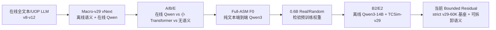

# LLM 用于体系结构仿真的实验复盘

> 更新时间：2026-07-23
>
> 范围：从早期在线端到端 LLM、A/B/E 因果对照，到当前 TCSim-v29 + 离线 LLM 语义分支
>
> 当前部署评测集：C4/C8/C16/C32，每个核数 23 条 trace，共 92 条；其中 16 条 `train_base`、7 条 `business_heldout`

## 1. 执行摘要

这段时间的实验回答了三个逐步收敛的问题：

1. **LLM 能否直接做仿真预测？**

   能。纯汇编文本输入的 Qwen3-14B 在 C4 上可以端到端预测部署所需的窗口推进量和 CPI，
   ROI CPI MAPE 为 **10.491%**。但单 trace 只有 **364.9 macro/s**，精度和吞吐都不如
   TCSim-v29，不能作为部署主线。

2. **在线 LLM backbone 是否优于普通小 Transformer？**

   现有 A/B/E 对照不支持这一结论。C8 上，使用在线 Qwen 的 A 为 **6.872%**，
   使用普通 Transformer 且保留静态 LLM embedding 的 B 为 **7.704%**，完全不使用
   LLM 语义的 E 反而为 **5.814%**；E 同时达到 **96,950.5 macro/s**，约为 A 的
   **4.60 倍**。因此在线 Qwen 的成本没有转化为稳定精度收益。

3. **把 LLM 限制为离线静态语义编码器，能否增强强基线 TCSim-v29？**

   有非常小的平均收益，但未形成可靠的 heldout 收益。当前最严格的同一 v29-60K 基座
   对照中：

   | 模型 | 92-trace ROI CPI MAPE | heldout MAPE | 结论 |
   |---|---:|---:|---|
   | strict TCSim-v29 | 4.8642% | 10.8514% | 强基线 |
   | B2-Frozen best-700 | 4.7484% | 10.8401% | 平均改善 0.1158pp，heldout 几乎不变 |
   | B2-LoRA best-700 | **4.6587%** | **10.8301%** | 平均再改善 0.0897pp，heldout 仅改善 0.0100pp |

最终判断是：

- **LLM 不是完全无用。** 在只有文本、缺少人工时序特征的弱设定下，预训练权重对
  heldout workload 有明显初始价值。
- **目前也不能证明 LLM 语义对强仿真模型有重要增益。** v29 已覆盖绝大多数资源、
  依赖和跨核时序信息；加入 Qwen3-14B 语义后，heldout 改善接近零，LoRA 收益主要来自
  train/base workload。
- **部署主线应继续使用 strict TCSim-v29。** 如需保留语义研究路线，采用“离线缓存
  + 可拆卸 bounded residual adapter”，默认 Frozen，LoRA 只作为实验选项；部署时不运行
  Qwen。

---

## 2. 指标口径与可比性

### 2.1 当前统一口径

- **ROI CPI MAPE**：每条 trace 先用完整 ROI 的预测周期数除以 retired instruction/macro
  得到预测 CPI，再计算相对真实 ROI CPI 的绝对百分比误差，最后对 trace 取平均。
- **makespan MAPE**：比较整条多核 trace 的完成时间/周期误差，能够反映慢核和跨核同步
  对总执行时间的影响。
- **per-window error**：窗口级局部预测误差；它不等同于 ROI 误差，局部正负误差可能在
  rollout 中累积或抵消。
- **吞吐量**：报告必须注明是 `uops/s`、`macro/s`、单 trace 还是多 GPU aggregate。
  不同 scheduler stride、context builder 和并行 GPU 数下的数值不可直接混排。
- 当前部署 rollout 为 label-free free-running，`target_stride=256`，不使用尾部
  lookahead。

### 2.2 历史结果的限制

v8–v12 使用历史数据、旧 scheduler 和 `pred-vs-ROI CPI pVr` 口径。它们适合说明架构演进、
上下文成本和核数外推趋势，**不能与当前 v29 的 92-trace ROI CPI MAPE 做严格横向排名**。

当前 v29 报告使用新的批量 context builder。旧 builder 生成的误差结果仍可使用，且 C4/C8
预测已做过逐项一致性核对；但旧、新 builder 的吞吐量不能直接比较。

---

## 3. 路线演进总览

演进方向不是不断加大 LLM，而是逐步把 LLM 从在线仿真主干移到离线特征提取位置：

- 在线全文本：语义最直接，但上下文、显存和吞吐压力最大；
- 一 macro 一位置：压缩序列，但在线 backbone 仍然昂贵；
- 离线单 macro 编码：Qwen 只在建 cache 时运行，部署只查 `semantic_id`；
- bounded residual：严格保留 v29 原预测路径，语义只能做小幅、可关闭的修正。

---

## 4. 第一阶段：在线全文本和 UOP 端到端模型

### 4.1 v8 到 v9：压缩 token 表示能显著提高吞吐

早期 v8 将汇编/UOP 展开为接近文本的 token，平均约 **6 token/UOP**。v9 改为 composite
UOP 表示，使一个 UOP 约占一个序列位置。

| 版本 | 核数 | 历史 CPI mean error | 吞吐量 | 说明 |
|---|---:|---:|---:|---|
| v8 | C8 | 9.66% | 3,883 uops/s；2,134 macro/s | 文本式输入，上下文浪费严重 |
| v9 | C8 | 5.53% | 25,775 uops/s；14,166 macro/s | 1 position/UOP，87.9ms/window |

v9 相比 v8 的 macro 吞吐约提高 **6.64 倍**。但这不是纯“语义编码”消融：同时包含数据、
schema、训练和 scheduler 改动，因此只能说明**压缩表示和系统重构有效**。

v9 的核数结果为 C4 4.06%、C6 4.66%、C8 5.53%；主要异常负载包括 false sharing 和
`ads_ranking_proxy`。

### 4.2 v11：0.6B 在线模型能跑，但 C32 外推失败

Qwen3-0.6B 在 C1/C4/C8/C16 上训练 8,000 step，总训练时间 8,940.9 秒，
即 **1.118 秒/step**。

| 核数 | CPI mean error | uops/s | macro/s |
|---:|---:|---:|---:|
| C4 | 5.71% | 20,200 | 11,244 |
| C8 | 7.80% | 24,624 | 13,632 |
| C16 | 11.26% | 24,941 | 13,797 |
| C32（训练未见） | **28.17%** | 21,563 | 11,916 |

结论：小模型的在线吞吐可以达到约 12K–14K macro/s，但对未见核数的多核关系外推很差。
固定最大上下文长度并不意味着 C32 不增加开销：C32 仍增加同时参与训练的 core row、
中间激活和跨核状态，而且训练分布没有覆盖该核数。

### 4.3 v12：更大的在线 LLM 没有自动带来更高精度

Qwen3-4B step-7500：

| 核数 | CPI mean error | uops/s | 每 window 时间 |
|---:|---:|---:|---:|
| C8 | 10.10% | 5,879 | 391.6ms |
| C16 | 14.99% | 6,739 | 793.6ms |

与 v11 0.6B 相比，4B 的平均误差更差，速度约慢 **3.7–4.2 倍**。这说明在仿真任务上，
模型参数量和通用语言能力不会自然转化为更好的时序预测；输入表示、标签、跨核结构和
rollout 一致性更关键。

### 4.4 原生 macro 文本的上下文瓶颈

Qwen2.5-Coder-1.5B 的短诊断中，C8 每个 scheduler step 为 2,048 个 lookahead macro
构造约 20,096 个 Qwen token，即：

- 约 **9.8 input token/lookahead macro**；
- 由于窗口重叠和部分 retirement，约 **24.2 processed token/retired macro**；
- 8 个 step 共退休 6,631 macro，耗时 5.865 秒；
- 仅 **1,131 macro/s**、1,437 uops/s，约 733ms/step。

因此，即使 32K context 能装下输入，填满上下文后的单卡吞吐也会落入几 KIPS 甚至更低；
上下文“装得下”不等于计算成本可以接受。

---

## 5. 第二阶段：Macro-v29 vNext——离线语义加在线 macro-level Qwen

该路线首次明确区分两类信息：

1. **离线语义**：Qwen 对单条汇编 macro/静态上下文编码，结果缓存；
2. **在线动态建模**：每核 256 个 macro state 进入在线 Qwen/LoRA，再进行跨核融合。

后期 macro state 扩大到 384 维，并加入逐 macro 的跨核 attention。该 attention 的复杂度是
`C × 256²`，不是 `(C × 256)²`；每个核的局部序列仍独立编码。C32 爆显存的根因主要是
32 组在线大模型训练激活和反向传播状态同时驻留，而不是把 32 核拼成一条 8,192 长序列。

### 5.1 原 checkpoint 的事后消融

C8、23 traces、stride 256：

| 干预 | ROI CPI MAPE | makespan MAPE | heldout MAPE | macro/s |
|---|---:|---:|---:|---:|
| Full real | **6.872%** | 7.045% | 17.033% | 21,075.7 |
| 去掉 offline hidden | 10.237% | 10.219% | 14.282% | 20,852.9 |
| 去掉 LoRA | 15.719% | 15.869% | 22.376% | 19,636.8 |
| semantic permutation | 13.735% | 13.894% | 21.053% | 20,733.3 |
| 去掉 LLM branch | 19.235% | 19.944% | 23.235% | 20,309.2 |

这证明该 checkpoint **依赖** LLM 分支和训练时的语义映射，但不是 LLM 必要性的因果证据：
所有干预都发生在训练完成后，会造成严重分布漂移；部分 heldout 置信区间也跨过零。

---

## 6. 第三阶段：A/B/E 重新训练对照

A/B/E 使用同一 C8 数据、seed 1234、`sequence_length=1`、30K step、23 条部署 trace：

- **A / Full-Qwen-Real**：真实静态语义，在线 Qwen2.5-Coder-1.5B + LoRA；
- **B / Transformer-Real**：保留相同静态语义，在线 Qwen 换成 5 层、d=384 的普通
  causal Transformer；
- **E / Transformer-Structured-Only**：不使用语义 cache，使用学习到的 `NO_SEM`，
  只保留数值、side feature 和跨核结构。

| 方案 | ROI CPI MAPE | makespan MAPE | heldout MAPE | macro/s |
|---|---:|---:|---:|---:|
| A：在线 Qwen | 6.872% | 7.045% | 17.033% | 21,075.7 |
| B：静态 LLM embedding + 小 Transformer | 7.704% | 8.127% | 20.006% | 74,215.8 |
| E：无 LLM 语义 | **5.814%** | **5.899%** | **15.168%** | **96,950.5** |

关键结论：

- E 精度最好，吞吐是 A 的 **4.60 倍**；
- B 比 A 快 **3.52 倍**，但静态 LLM embedding 没有带来比 E 更好的精度；
- A 的在线 Qwen 虽使用的是 learned macro state 而非原生 Qwen token，其预训练语义能力
  很难被直接调用，普通 Transformer 已能完成同类序列建模；
- 原 checkpoint 的 post-hoc 消融与重新训练 A/B/E 并不矛盾：前者说明模型形成了依赖，
  后者说明这种依赖并非获得好精度所必需。

---

## 7. 第四阶段：Full-ASM 纯汇编端到端预测

为了回答“完全不用 TCSim 特征，LLM 单独能不能预测”，增加 Full-ASM 开关，保留其他路线
代码但绕过 TCSim 跨核融合：

- Qwen3-14B，C4；
- 原生 tokenizer 处理四核汇编，四核共同位于一个 causal context；
- 加入 4×256 个 learned macro query，最大 32K token；
- 无 TCSim numeric/side/UOP timing feature，无 post-Qwen core mixer；
- LoRA `r=32, alpha=64, dropout=0.05`，可训练参数 45.494M，其中 LoRA 41.943M；
- 训练 2,000 step。

### 7.1 训练和部署结果

| 项目 | 结果 |
|---|---:|
| 训练时间 | 15,796.5s，约 4小时23分 |
| 训练峰值显存 | 84.22GiB |
| activation checkpoint | 40 层中选择性 checkpoint 20 层 |
| C4 ROI CPI MAPE | **10.491%** |
| train_base MAPE | 9.681% |
| heldout MAPE | 12.342% |
| makespan MAPE | 11.925% |
| 单 trace 平均吞吐 | **364.9 macro/s** |
| 8-GPU aggregate effective throughput | 2,256.9 macro/s |
| 完成 23 traces 的部署 wall-clock | 约 6小时57分 |
| 平均一次 forward | 906.5 macro，2.495s |

结论：LLM 能从纯汇编文本学习到与 CPI 有关的信息，但在线 14B 模型的工程成本过高；
与约 5% MAPE、数万 uops/s 的 v29 相比，这条路线不适合部署。

---

## 8. 第五阶段：0.6B Real/Random——预训练权重是否有价值

使用相同 Qwen3-0.6B-Base 架构做严格配对：

- **Real**：加载真实预训练权重；
- **Random**：同一网络结构随机初始化并冻结 base；
- tokenizer、Full-ASM 输入、LoRA、task head、数据顺序、seed 和 2,000 step 完全相同；
- 两者可训练参数均为 10.064M。

| 指标 | 0.6B Real | 0.6B Random |
|---|---:|---:|
| all ROI CPI MAPE | 14.684% | **11.810%** |
| train_base MAPE | 17.047% | **9.128%** |
| heldout MAPE | **9.285%** | 17.941% |
| heldout median | **6.872%** | 13.835% |
| 平均吞吐 | 3,643.2 macro/s | 3,742.4 macro/s |
| 训练时间 | 约 30.2 分钟 | 约 30.2 分钟 |
| 峰值显存 | 20.335GiB | 20.335GiB |

Real 的 all 平均被 `fp_alu_dense` 的 123.341% 极端误差拖坏；去掉该异常 trace 后，
Real 为 9.745%，Random 为 11.425%。更重要的是，在 heldout 上 Real 比 Random 改善
**8.655pp（相对 48.24%）**，bootstrap CI 为 `[2.318, 14.772]`。

这组实验支持一个有限结论：**当模型只能看到文本、缺少强时序特征时，预训练权重包含
有助于新 workload 的先验。** 但它不能证明这种收益必然来自人类意义上的“汇编语义”，
也不能把 0.6B 与 14B 的差异直接解释为语义能力差异，因为模型规模、优化难度和异常值都
没有完全受控。

---

## 9. 第六阶段：B2/E2——把离线 LLM embedding 接入 TCSim-v29

### 9.1 数据与模型结构

- 训练集扩展到 C1–C32；
- 部署验证为 C4/C8/C16/C32 的 92 traces；
- Qwen3-14B 对单条 macro 及静态 BB 上下文离线编码，平均约
  **11.46 tokenizer token/macro**；
- 生成 5,120 维静态 embedding，并用 `semantic_id sidecar` 与 trace/UOP 对齐；
- 部署时不运行 Qwen，只查 cache；
- TCSim-v29 的完整 per-UOP feature、full-QKVR 和跨核时序主干保持存在；
- embedding 经投影/门控后注入 v29 hidden。

由于每条 macro 独立离线编码，C32 不会产生在线 Qwen 的 32 倍 activation；部署压力来自
cache 查表和小 adapter，而不是 14B backbone。

### 9.2 从头训练的 10K 初步结果

| 模型 | ROI CPI MAPE | makespan MAPE | heldout MAPE | uops/s |
|---|---:|---:|---:|---:|
| E2-null / NO_SEM | 8.7500% | 8.8821% | 18.6491% | **92,209.7** |
| B2-frozen / real semantic | **7.6282%** | **7.6295%** | **14.3089%** | 88,412.1 |

10K 时，真实语义平均改善 1.1218pp，heldout 改善 4.3402pp，吞吐下降约 4.1%，曾显示出
较强潜力。

### 9.3 精确续训到 30K 后的反转

| 模型 | ROI CPI MAPE | makespan MAPE | heldout MAPE | uops/s |
|---|---:|---:|---:|---:|
| E2-null | **8.0339%** | 8.3411% | **13.9823%** | **92,288.6** |
| B2-real | 8.3137% | **8.1344%** | 16.9149% | 88,416.7 |
| B2-shuffled | 9.7223% | 9.8623% | 23.9280% | 88,377.9 |

30K 时：

- 正确语义显著优于 shuffled，说明 **macro 与 embedding 的正确身份映射确实重要**；
- 但 B2-real 不再优于 E2-null，heldout 反而差 2.9326pp；
- 10K 的收益没有随训练保持，说明从头训练的 bridge、额外容量和优化轨迹与“语义价值”
  混在一起；
- 因此需要固定强基线 checkpoint，并保证关闭语义时逐值等价。

---

## 10. 当前方案：v29-60K 强基线上的 bounded residual 语义

### 10.1 设计

当前实验以 TCSim-v29 60K run 的 best checkpoint（step 59,000）为固定基座：

- Qwen3-14B base 冻结，语义 embedding 离线生成；
- 融合位置为 static + dynamic + side feature 求和之后、full-QKVR 之前；
- adapter 为 `pre-qkvr-bounded-gated-residual-v2`，hidden=1024；
- final projection 零初始化，训练开始时与 strict v29 **逐值等价**；
- 语义残差 RMS 硬限制为 base hidden RMS 的 5%；
- loss 只保留 `L_v29 + 0.1 × L_residual`，不使用 `L_static`、`L_sem`；
- strict bypass 可完全关闭语义；LoRA 可拆卸；
- 只用 C4/C8 做 adapter/LoRA 微调，C16/C32 用于核数扩展验证。

训练过程：

- adapter warmup 400 step，约 49.6 秒；
- Frozen 分支再训练 1,800 step，约 212.9 秒；
- LoRA 分支采用 gradient cache 训练 1,800 step，约 31,985.6 秒，即 8小时53分；
- 含 warmup 的长任务约 9小时26分；
- 两个分支的 validation best 都出现在 step 700，继续到 2,200 没有稳定收益。

### 10.2 C4–C32 全量结果

| 模型 | all ROI MAPE | train_base | heldout | C4 | C8 | C16 | C32 |
|---|---:|---:|---:|---:|---:|---:|---:|
| strict v29 | 4.8642% | 2.2448% | 10.8514% | 5.0926% | 4.6220% | 4.4658% | 5.2762% |
| Frozen best-700 | 4.7484% | 2.0832% | 10.8401% | 4.8316% | 4.5518% | 4.4709% | 5.1393% |
| **LoRA best-700** | **4.6587%** | **1.9587%** | **10.8301%** | **4.6991%** | 4.6208% | **4.3040%** | **5.0110%** |
| Frozen latest-2200 | 4.7088% | 2.0367% | **10.8165%** | 4.7797% | 4.5911% | 4.3131% | 5.1513% |
| LoRA latest-2200 | 4.7653% | 2.0921% | 10.8755% | 5.0465% | **4.5559%** | 4.3126% | 5.1463% |

最重要的配对差值：

- Frozen best 相比 strict：all 改善 **0.1158pp**，heldout 改善 **0.0113pp**；
- LoRA best 相比 Frozen best：all 再改善 **0.0897pp（相对 1.89%）**，
  heldout 只改善 **0.0100pp**；
- LoRA best 相比 strict：all 总改善 **0.2055pp**，其中绝大部分来自 train/base；
- LoRA latest 比 LoRA best 退化 0.1066pp，继续训练没有带来更好泛化。

C4+C8 训练核数上的汇总为：

| 模型 | C4+C8 ROI CPI MAPE |
|---|---:|
| strict v29 | 4.8573% |
| Frozen best | 4.6917% |
| LoRA best | **4.6600%** |
| Frozen latest | 4.6854% |
| LoRA latest | 4.8012% |

LoRA 在已见核数上的最佳点略好，但 latest 已过拟合；C16/C32 没出现核数外推崩溃，
说明 bounded residual 保住了 strict 主干的稳定性。

### 10.3 当前吞吐量

在当前批量 context builder 下，C4/C8：

| 模型 | uops/s | 相对 strict |
|---|---:|---:|
| strict v29 | **82,522** | 1.000× |
| Frozen best | 75,666 | 0.917× |
| LoRA best | 75,569 | 0.916× |

即部署语义分支带来约 **8.4% 吞吐下降**。B2 全量报告记录约
87.3K–87.8K uops/s，但 strict C4–C32 的旧报告来自不同 context builder，因此不能用旧值
计算全核数的精确相对下降；需要在同一 builder 下重跑 strict 才能给出严格数字。

LoRA 不会让部署侧运行 Qwen，但 LoRA-specific embedding cache 与 Frozen cache 不同，
切换 LoRA 时需要离线重建对应 cache。

### 10.4 收益主要出现在哪些 workload

以下为 LoRA best 相比 strict v29、对 C4–C32 取平均的变化。

改善最大的 workload：

| workload | strict | LoRA best | 改善 |
|---|---:|---:|---:|
| SIMD SSE dense | 5.3441% | 3.8267% | -1.5174pp |
| gofeed base | 3.2550% | 2.0855% | -1.1695pp |
| memory seq moderate | 2.8711% | 1.7277% | -1.1434pp |
| marine heldout | 5.6682% | 4.7527% | -0.9155pp |
| redis heldout | 42.3254% | 41.4431% | -0.8823pp |
| flink heldout | 7.5139% | 6.7898% | -0.7241pp |
| memory random | 1.3768% | 0.7986% | -0.5781pp |

退化最大的 workload：

| workload | strict | LoRA best | 退化 |
|---|---:|---:|---:|
| bvc encoder heldout | 3.3023% | 5.6336% | +2.3313pp |
| marine base | 1.8257% | 2.6745% | +0.8488pp |
| cache L1 | 1.3774% | 1.9715% | +0.5941pp |
| cache L2 | 2.3992% | 2.8860% | +0.4868pp |
| gofeed heldout | 9.6558% | 10.1313% | +0.4755pp |

92 traces 中 59 条改善、33 条退化；heldout 28 条中 18 条改善、10 条退化。尾部指标为：

| 范围 | 指标 | strict v29 | LoRA best |
|---|---|---:|---:|
| all | P90 | **7.188%** | 7.322% |
| all | P95 | **12.327%** | 12.439% |
| all | max | 45.469% | **44.676%** |
| heldout | P90 | 40.119% | **39.214%** |
| heldout | P95 | 42.357% | **41.439%** |
| heldout | max | 45.469% | **44.676%** |

语义对 redis 等极端负载只有约 0.9pp 改善，仍保持 40% 以上误差；同时 all P90/P95 略有
退化。因此不能声称语义分支已经解决 tail workload。

---

## 11. 跨阶段结果汇总

下表用于快速回顾，不代表所有行可以严格横向比较：

| 阶段 | 模型/配置 | 评测范围 | CPI/ROI MAPE | 吞吐量 | 主要结论 |
|---|---|---|---:|---:|---|
| 早期在线 | v8 文本式 UOP | 历史 C8 | 9.66% | 2,134 macro/s | token 膨胀严重 |
| 早期在线 | v9 composite UOP | 历史 C8 | 5.53% | 14,166 macro/s | 压缩表示显著提速 |
| 在线小 LLM | v11 Qwen3-0.6B | 历史 C8/C32 | 7.80% / 28.17% | 13,632 / 11,916 macro/s | C32 未见核数外推失败 |
| 在线较大 LLM | v12 Qwen3-4B | 历史 C8 | 10.10% | 5,879 uops/s | 更大模型更慢且未更准 |
| Macro-v29 A | 在线 Qwen + 静态语义 | 当前 C8-23 | 6.872% | 21,075.7 macro/s | checkpoint 依赖 LLM，但非必要性证据 |
| A/B/E 的 B | 静态语义 + 小 Transformer | 当前 C8-23 | 7.704% | 74,215.8 macro/s | 在线 Qwen 可被轻量序列模型替代 |
| A/B/E 的 E | 无 LLM 语义 | 当前 C8-23 | **5.814%** | **96,950.5 macro/s** | A/B/E 中最佳 |
| Full-ASM | Qwen3-14B text-only | C4-23 | 10.491% | 364.9 macro/s/trace | 可学习，但部署不可接受 |
| Full-ASM | Qwen3-0.6B Real | C4-23 | 14.684%；heldout 9.285% | 3,643.2 macro/s | 预训练权重帮助 heldout |
| Full-ASM | Qwen3-0.6B Random | C4-23 | 11.810%；heldout 17.941% | 3,742.4 macro/s | all 被异常值/分层差异影响 |
| B2/E2 10K | Frozen / NO_SEM | C4-C32 | 7.628% / 8.750% | 88.4K / 92.2K uops/s | 早期收益未保持 |
| B2/E2 30K | Real / NO_SEM / shuffled | C4-C32 | 8.314% / 8.034% / 9.722% | 约 88–92K uops/s | 映射重要，但 real 不胜 NO_SEM |
| 当前强基线 | strict v29 | C4-C32 | 4.8642% | 82.5K uops/s（C4/C8） | 当前部署主线 |
| 当前 Frozen | bounded adapter best-700 | C4-C32 | 4.7484% | 75.7K uops/s（C4/C8） | 小幅平均收益，heldout 不变 |
| 当前 LoRA | bounded adapter best-700 | C4-C32 | **4.6587%** | 75.6K uops/s（C4/C8） | 最低平均误差，但 LoRA 增益很小 |

---

## 12. 对“LLM 语义是否有用”的最终判断

### 12.1 已被实验支持的结论

1. **原生文本表示的 token 成本是第一性瓶颈。** 平均约 10 token/macro 时，32K context
   很快被填满；即使不 OOM，在线大模型吞吐也无法满足仿真部署。
2. **预训练权重在 text-only 弱设定中有价值。** 0.6B Real 在 heldout 上显著优于同架构
   Random，说明不是所有效果都能由 LoRA 和预测头从零拟合出来。
3. **正确的 semantic mapping 包含信息。** B2-real 明显优于 B2-shuffled。
4. **强结构化特征决定了主要精度。** 无语义 A/B/E-E 和 strict v29 都能达到很强结果；
   当前 14B 语义对 heldout 的边际收益接近零。
5. **LoRA 的任务化语义收益尚不可靠。** 它训练成本高，最佳点早，继续训练退化；相对
   Frozen 的 heldout 改善只有 0.0100pp。

### 12.2 不能从现有实验推出的结论

- 不能说“LLM 完全没用”：Real/Random text-only 结果反驳了这个绝对判断。
- 不能说“14B 比小模型语义更强，所以仿真一定更准”：Full-ASM 已显示规模不单调。
- 不能用 post-hoc 去分支结果宣称 LLM 是必要条件：那是训练后分布破坏。
- 不能把 B2-real 优于 shuffled 等价为 B2-real 优于强基线：它只证明向量身份映射有信息。
- 不能把 0.2pp 的 all 平均改善解读为稳健泛化：heldout 几乎未变，部分 workload 明显退化。

### 12.3 当前最合理的解释

LLM 对汇编能够提供静态 opcode、operand、访存形式、控制流和局部程序意图等先验；这些信息
在缺少专门特征时很有帮助。但 TCSim-v29 已显式建模 UOP 类型、资源、依赖、访存和跨核时序，
LLM embedding 与既有特征高度重叠。剩余误差更多来自动态 cache/coherence/contention、
长程状态和 rollout，而不是单条 macro 的静态文本语义。因此，继续增大 LLM 或增加 LoRA
训练步数，很难自然解决当前 tail error。

---

## 13. 推荐主线与后续实验

### 13.1 工程主线

1. 默认部署 **strict TCSim-v29**；
2. 保留 Frozen bounded adapter 作为可选实验开关；
3. 保持 `semantic_id sidecar`、离线 cache 和 strict bypass；
4. 不在部署侧运行 Qwen，不恢复在线全文本或在线 macro-level Qwen；
5. LoRA 不作为默认组件：只有在更多 seed 和真正 unseen binary family 上稳定优于 Frozen
   后再进入候选主线。

### 13.2 若继续验证 LLM 语义，优先做的实验

1. 在相同 v29 checkpoint、adapter 参数量和训练轨迹下做
   `real / shuffled / random-vector / opcode-only / text-hash` 配对；
2. 增加按 binary family 隔离的 heldout，而不只是在相同程序族内拆 trace；
3. 至少 3 个训练 seed，报告 workload-paired bootstrap 和跨 seed 方差；
4. 分析 LLM 只可能补充而 v29 缺失的特征，如符号、立即数语义、基本块上下文和高层操作
   模式，避免重复编码已有 resource ID；
5. 针对 redis、bvc encoder 等 tail workload，先诊断动态 cache/coherence/同步误差，
   不应默认归因于静态语义不足。

准入门槛建议：语义方案必须在 heldout 上稳定改善至少 0.5pp，不能恶化 P90/P95，且部署
吞吐下降不超过 5%；否则不替代 strict v29。

---

## 14. 证据与报告路径

- v8/v9：`docs/eval_v9_vs_v8_precision_throughput_20260627.md`
- v11：`docs/eval_v11_timing_qwen3_0p6b_step8000_results_20260629.md`
- v12：`docs/eval_v12_summary_qwen3_4b_step7500_results_20260630.md`
- Macro-v29 方案与设计演进：`docs/macro_v29_offline_semantic_online_qwen_design.md`
- Stage-1 post-hoc：
  `eval_results/macro_v29_stage1_posthoc_c8_20260719_165753/report.md`
- A/B/E：
  `eval_results/macro_v29_abe_c8_deploy23_20260720_005640_comparison/summary.md`
- Full-ASM Qwen3-14B：
  `eval_results/macro_v29_full_asm_c4_step2000_deploy23_20260721_003538/summary.json`
- Qwen3-0.6B Real/Random：
  `eval_results/macro_v29_full_asm_qwen3_0p6b_base_c4_pair_s1_2k_20260721_112611_deploy_20260721_130119_comparison/summary.md`
- B2/E2 10K：
  `eval_results/tcsim_v29_e2null_b2frozen_qwen3_14b_c1_c32_s4_30k_20260721_163433_deploy_c4_c8_c16_c32_s256_20260721_203207/comparison.md`
- B2/E2 30K：
  `eval_results/tcsim_v29_resume3_b2first_s4_10k_to30k_20260722_020432_parallel_deploy_c4_c8_c16_c32_s256_20260722_125611`
- 当前 bounded adapter/LoRA 全量对照：
  `eval_results/tcsim_v29_bounded_gate_b2_best700_latest2200_full_c4_c32_s256_20260723_113131/comparison/comparison.md`
- strict v29 全量预测来源：
  `/data00/yinhaolang/TCSim/logs/v29_packed3_free_s256_seed0_seed1_c04_c08_c16_c32_full/report.json`

> 复现实验时应同时保存 checkpoint SHA256、代码 commit、数据 manifest、context builder 版本、
> seed 和 trace key；缺少其中任一项的历史结果只作为趋势证据，不升级为正式基线。
